# freecad_aquarium
This [FreeCAD](https://www.freecad.org/) extension is a tool to create a parametric drawing for a aquarium

## Install

First, download and install [FreeCAD](https://www.freecad.org/)

You have two options to install this extension:
* Via the FreeCAD [Addon Manager](https://wiki.freecadweb.org/Addon_manager)
* Manually, cloning the [git repository](https://github.com/MarinheirodoAlem/freecad_aquarium) inside the Mod folder

### Install with addon manager

Inside FreeCAD, add this repository to the list of custom repositories following those steps:
* Choose menu Edit/Preferences/Addon Manager
* Add the url *https://github.com/MarinheirodoAlem/freecad_aquarium* and the branch *release* to the list

Then install this addon from the list.

## Usage

Use this tool to generate the desired parts inside one FreeCAD project.

1. Install the extension
2. Open a document or create a new one
3. Choose the Aquarium workbench
4. Choose the option to create the desired feature. For instance, **Aquarium Generation/Structure**
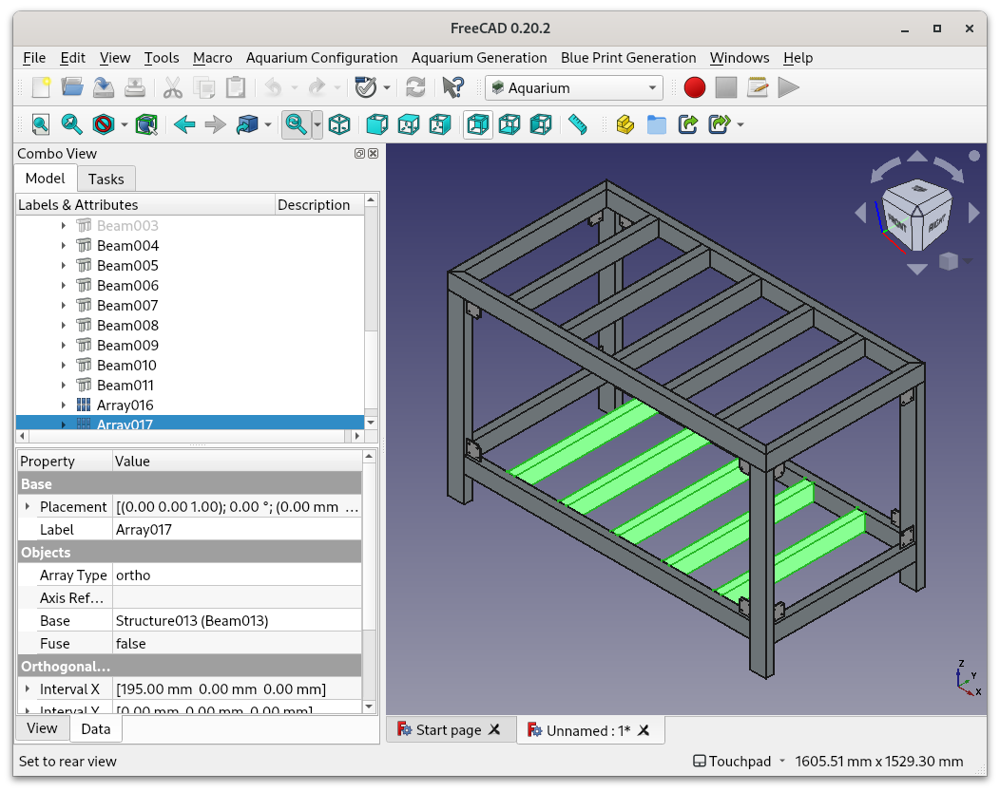
5. **Aquarium Generation/Structure Panels**
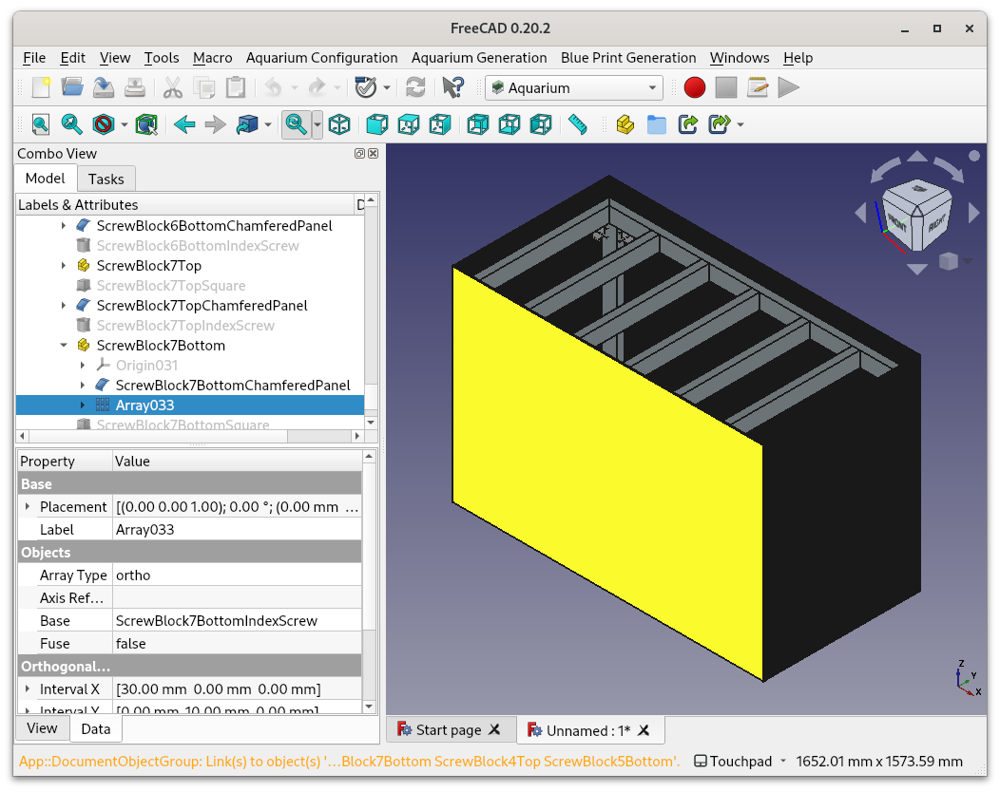
6. **Aquarium Generation/Leveling Base**
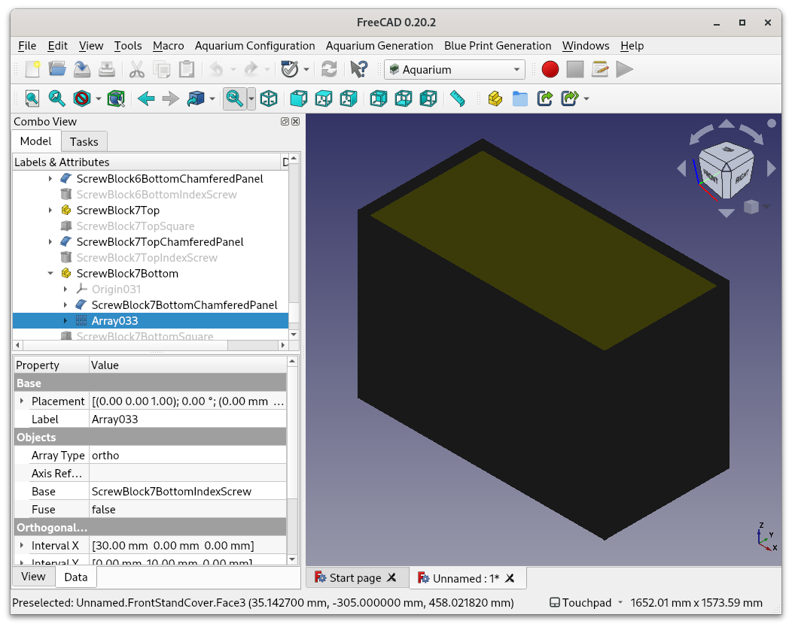
7. **Aquarium Generation/Glass Panels**
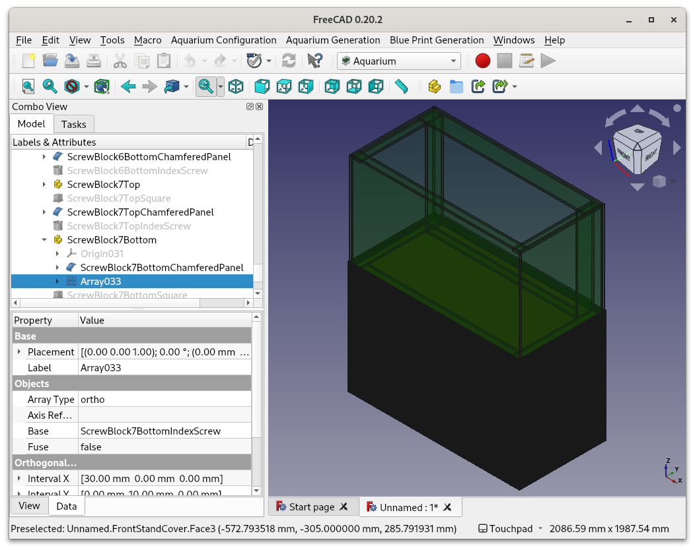

Skip the Weir for now. Lets create it in the end of the example, because it is not optimized and FreeCAD take a long time to recompute every constrain.
8. **Aquarium Generation/Flanges Pipes**
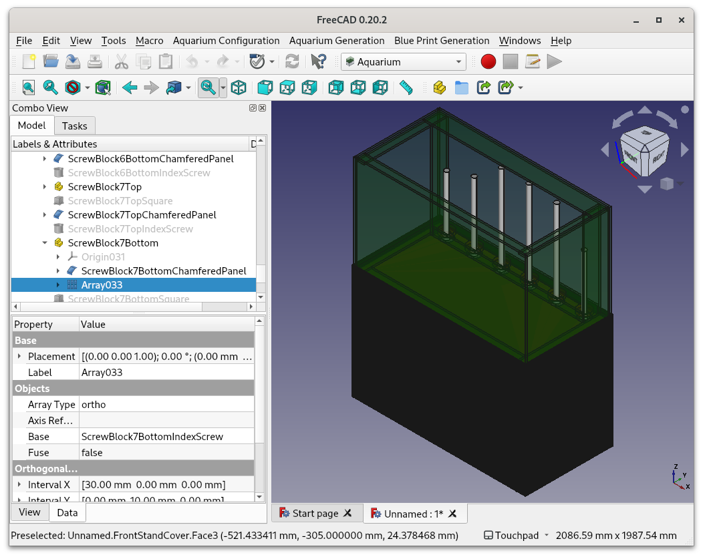
9. **Aquarium Generation/ClosedLoop**
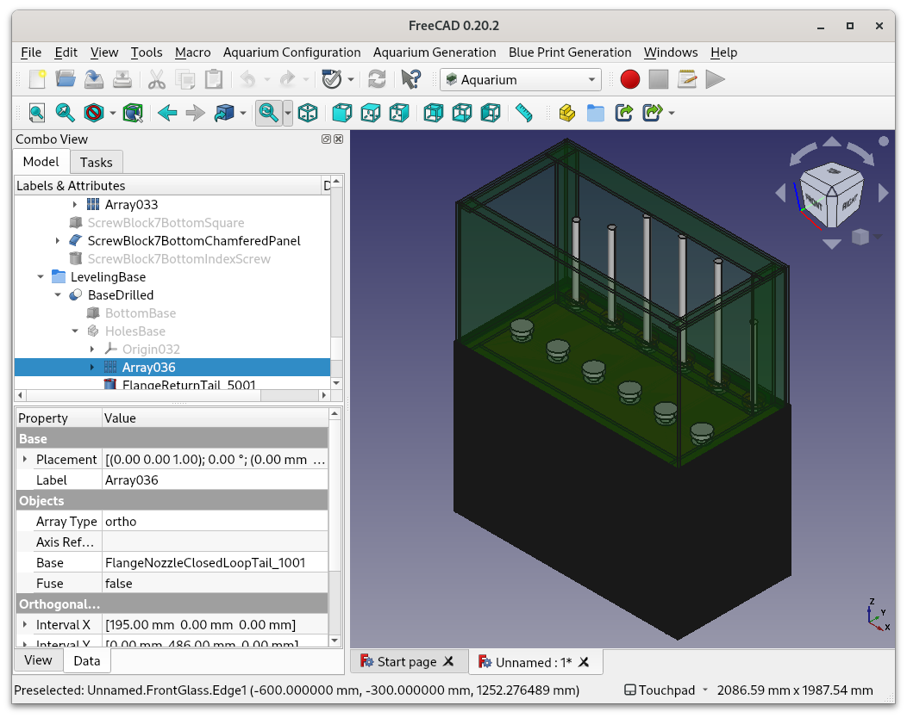
10. **Aquarium Generation/Canopy**
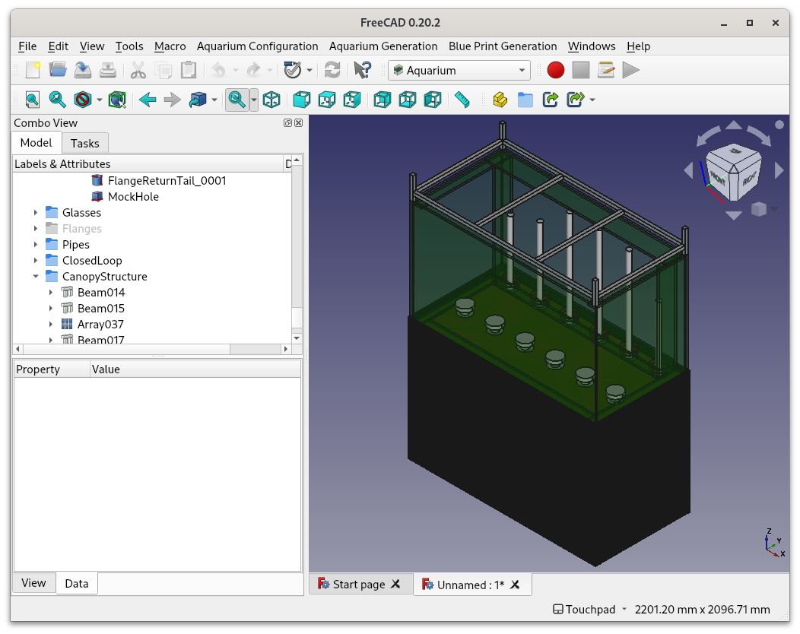
11. **Aquarium Generation/Canopy Panels**
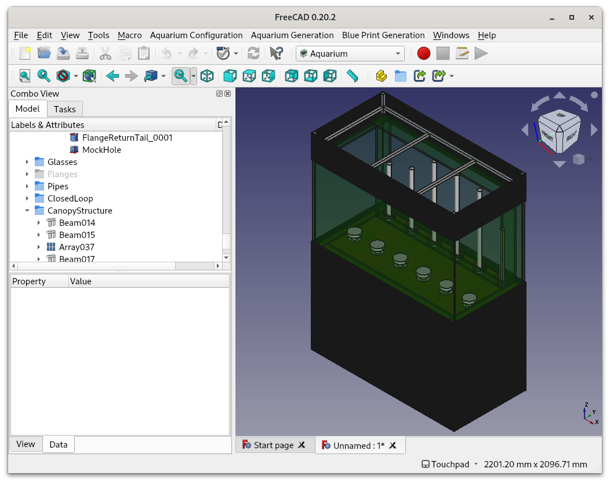
12. Now lets generate the Weir.
Since it is heavy to compute, it is a nice idea to enable the FreeCAD to allow to abort recomputation:
Choose Edit/Preferences/General/Document/Allow aborting recomputation.
13. **Aquarium Generation/Weir**
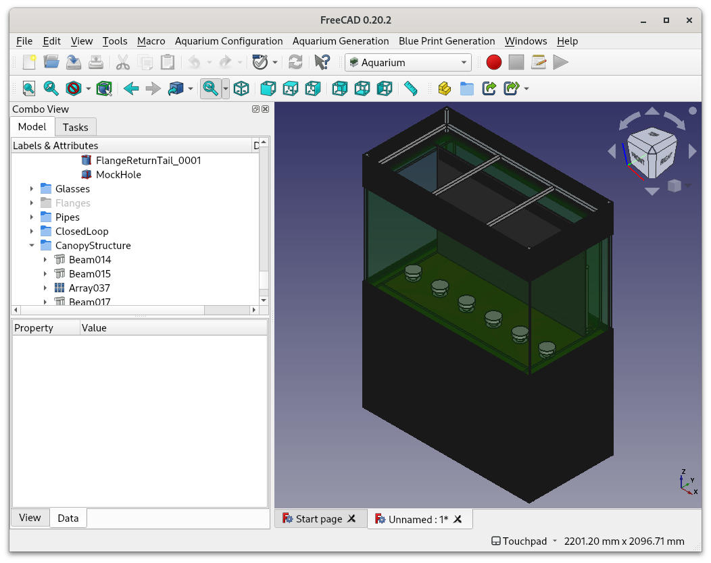
14. Let's change the dimensions for a penninsula aquarium, to show the problems that you should be aware of when the piping collides with the structure.
15. **Aquarium Configuration/Structure**
16. Change the width to 800mm, and the length to 1500mm.
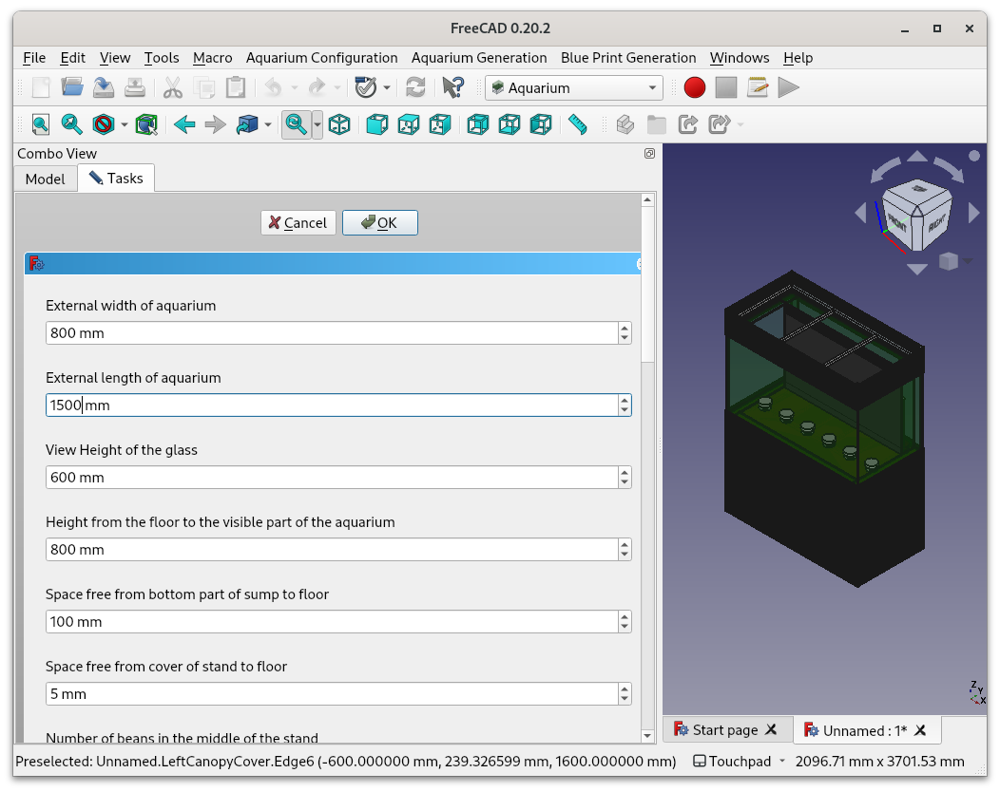
17. You must check the project for inconsistencies, like the pipes colliding with the glass of the weir, like this:
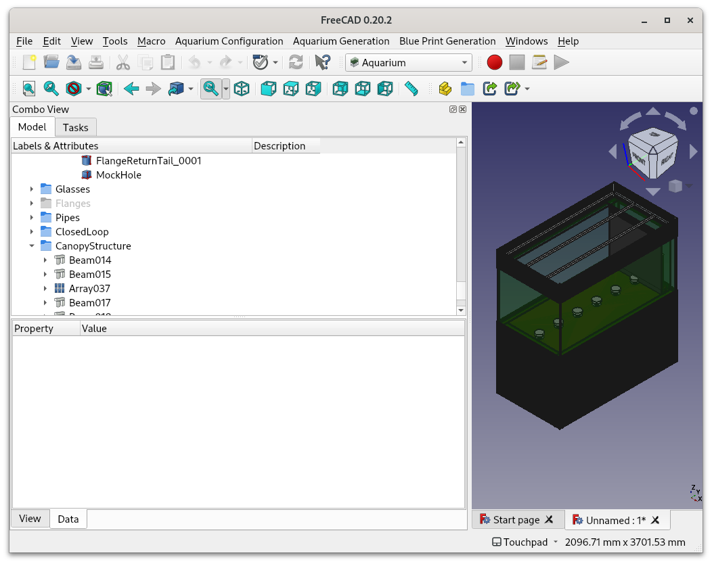
18. This is one of the few cases where you can fix it with an option. choose **Aquarium Configuration/Plumbing**
19. Change *Number of spaces between beams to keep clean of nozzles after distribution* to **1**:
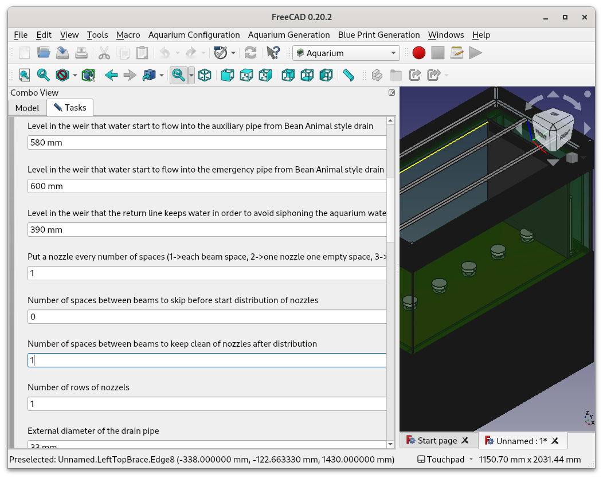
20. Then you got a drawing that must be revised to any inconsistency.
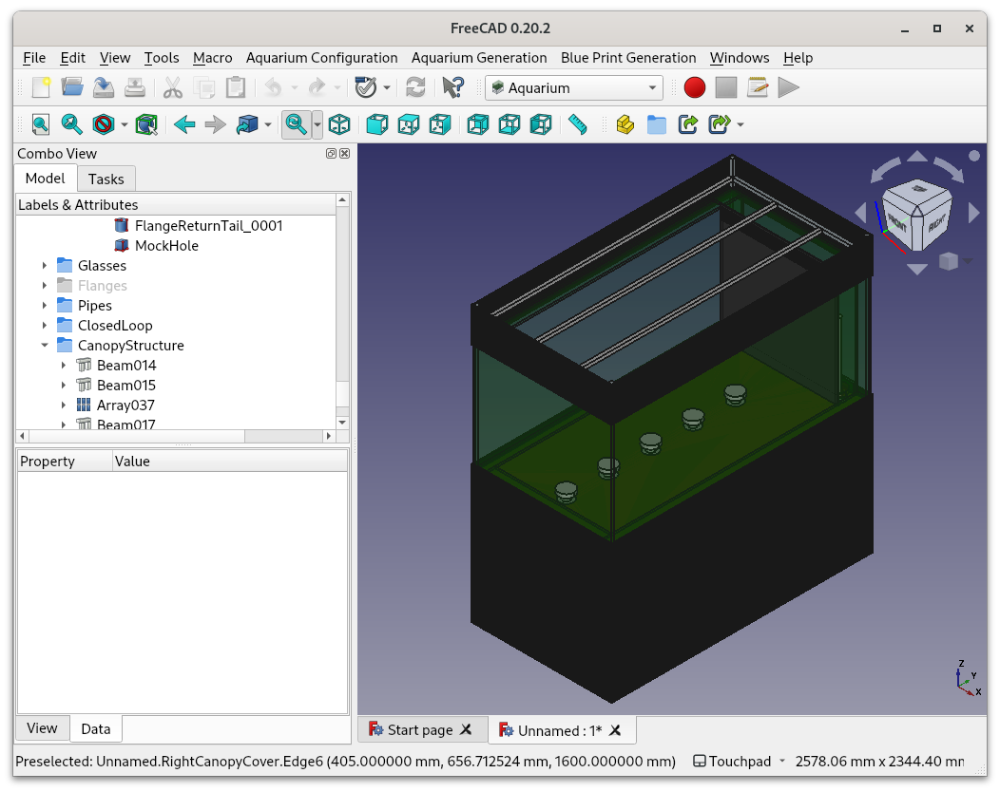
Now you can use all the normal FreeCAD workflow to customize the drawing even further. The tool will dump a parametric drawing,
any configuration is made in spreadsheets, so with some luck you may be able generate, customize, and config your drawing, without having to
create the parts again after changing the parameters.

## Discussion/Feedback

# Development

## Guidelines

This tool tries to dump a parametric drawing and do not need to tweak with the drawing after created, all configuration should be in the parameters,
and the drawing should adjust itself. If you want to extend this tool and have you changes merged back, please make sure that this feature is preserved after
your changes.

## Bugs/Enhancements

Please open tickets in the [issue queue](https://github.com/MarinheirodoAlem/freecad_aquarium/issues)

## Authors

Marinheiro do Alem <Marinheiro@doalem.com>