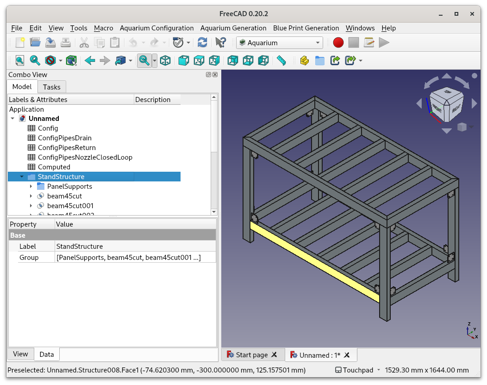
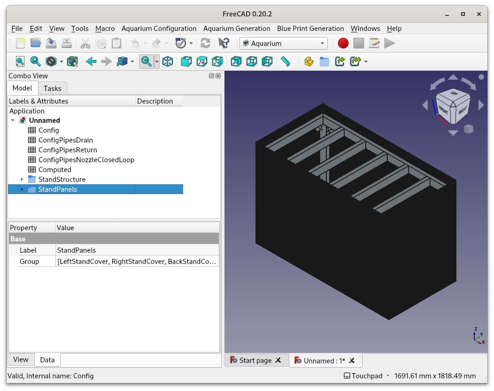
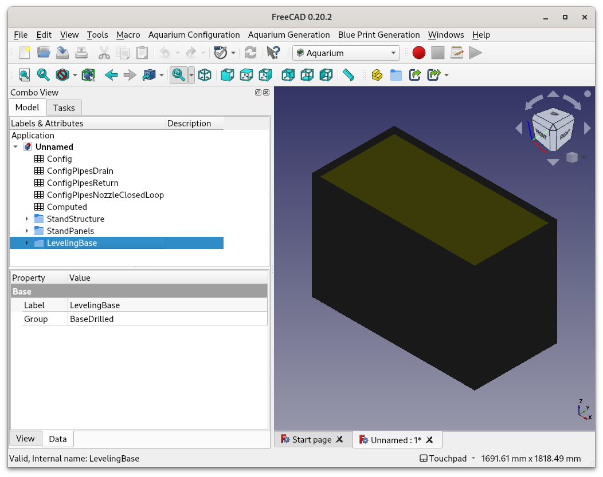
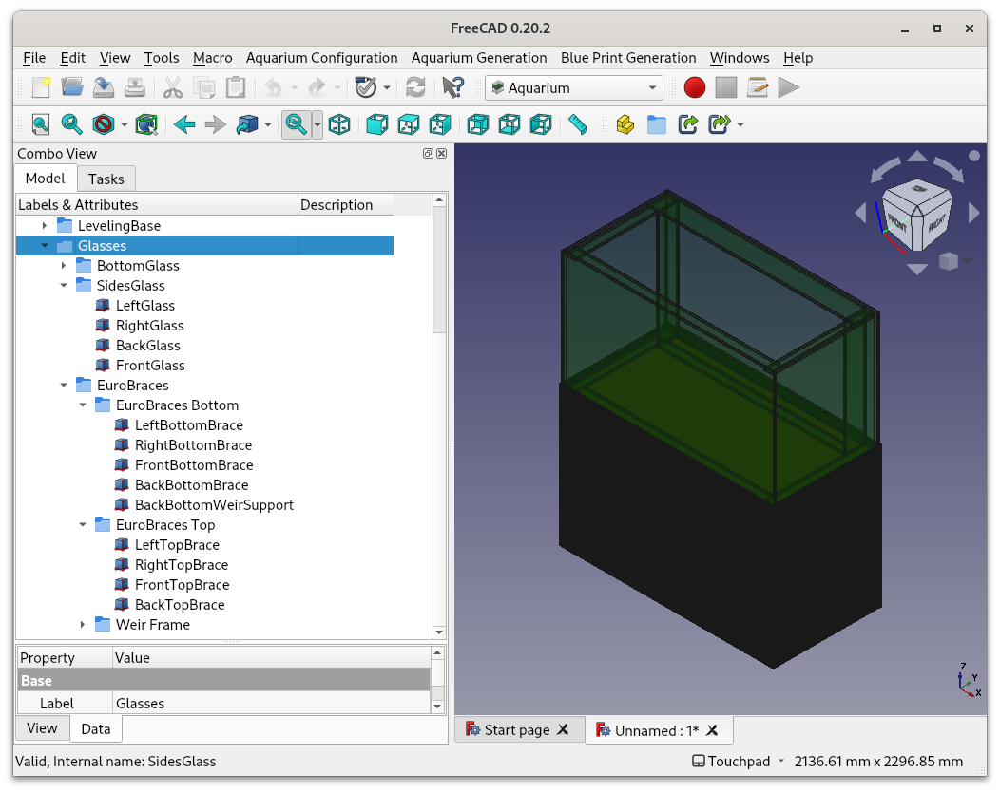
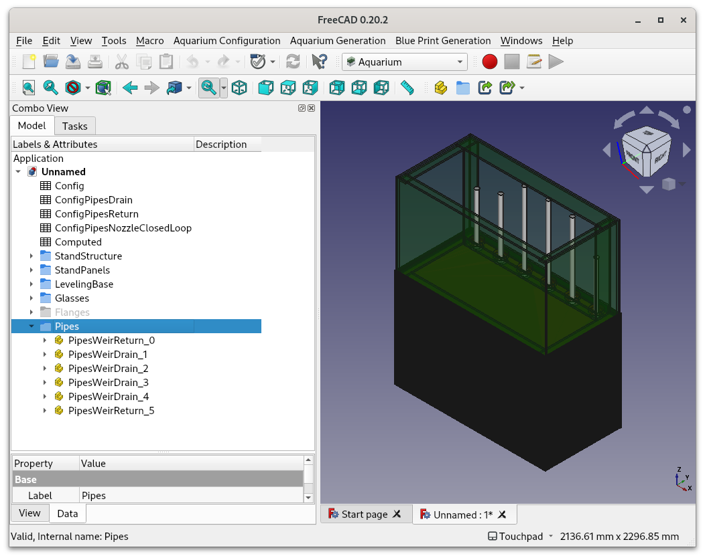
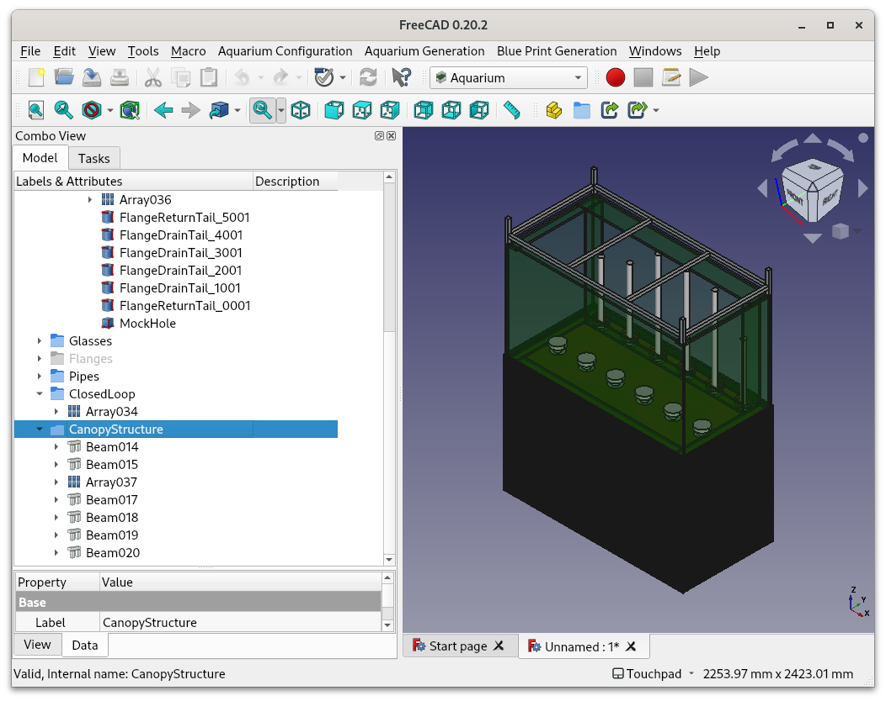
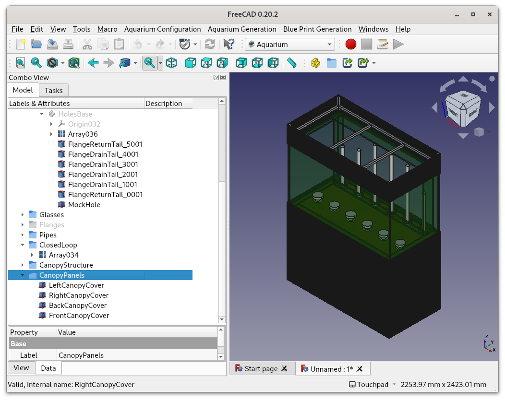
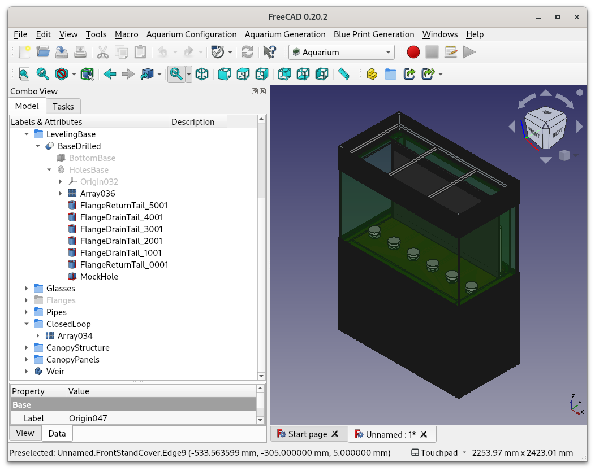

# freecad_aquarium
This [FreeCAD](https://www.freecad.org/) extension is a tool to create a parametric drawing for a aquarium

## Install

First, download and install [FreeCAD](https://www.freecad.org/)

You have two options to install this extension:
* Via the FreeCAD [Addon Manager](https://wiki.freecadweb.org/Addon_manager) (Recommended for users)
* Manually, cloning the [git repository](https://github.com/MarinheirodoAlem/freecad_aquarium) inside the Mod folder (Best option for developers)

### Install with addon manager

Inside FreeCAD, add this repository to the list of custom repositories following those steps:

1. Choose menu **Edit/Preferences/Addon Manager**
2. Add the url *https://github.com/MarinheirodoAlem/freecad_aquarium* and the branch *release* to the list
3. Open the addon manager with **Tools/Addon Manager**
4. Find and install this addon from the list.

## Usage

Use this tool to generate the desired parts inside a FreeCAD document.

1. Install the extension if not done it already
2. Open a document or create a new one
3. Choose the Aquarium workbench
4. Choose the option to create the desired feature.

For instance, **Aquarium Generation/Structure**

This step create a structure to support the weight inside a group *StandStructure*

**Aquarium Generation/Structure Panels**

This will create one option to fasten panel inside a group names *StandPanels*

**Aquarium Generation/Leveling Base**

This base is used to distribute the weight of the glass in the structure, and it weight is used to hide part of the flange away from the structure, avoiding collisions.
Show and hide the parts and inspect if there is enough room around every part in order to prevent collisions. Pay special attention to the flanges, all parameters will change depending on the real flange that you choosed.

**Aquarium Generation/Glass Panels**

Skip the Weir for now. Lets create it in the end of the example, because it is not optimized and FreeCAD take a long time to recompute it.

**Aquarium Generation/Flanges Pipes**

**Aquarium Generation/ClosedLoop**

**Aquarium Generation/Canopy**

**Aquarium Generation/Canopy Panels**

Now lets generate the Weir.
Since it is heavy to compute, it is a nice idea to enable the FreeCAD to allow to abort recomputation:
Choose Edit/Preferences/General/Document/**Allow aborting recomputation.**
**Aquarium Generation/Weir**

Let's change the dimensions for a penninsula aquarium, to show the problems that you should be aware of when the plumbing collides with the structure.
**Aquarium Configuration/Structure**
Change the width to 800mm, and the length to 1500mm.

You must check the project for inconsistencies, like the pipes colliding with the glass of the weir, like this:

This is one of the few cases where you can fix it with an option. choose **Aquarium Configuration/Plumbing**
Change *Number of spaces between beams to keep clean of nozzles after distribution* to **1**:

Then you got a drawing that must be checked for any inconsistency. **This tool won't check if there is a collision, flanges don´t fit, or the metal structure, glass or silicone bonding is too weak to support the weight and pressure**. Paper accepts everything printed on it (think toilet paper), but is up to you to figure out the materias and what can handle the load with a good margin of security, enough to give you peace of mind.

Now you can use all the normal FreeCAD workflow to customize the drawing even further. The tool will dump a parametric drawing,
any configuration is made in spreadsheets, so with some luck you may be able generate, customize, and config your drawing, without having to
create the parts again after changing the parameters.
You may export the weir drawing in a format suitable to laser cut into acrylic panel.
For the metallic and glass parts, you can use the generate tech draw to create a drawing suitable to print and use it as a guide to build the project.
Using the structure as an example, lets build a drawing for the base:
Select **Blue Print Generation/BaseBluePrint**

Now switch to the Tech Draw Workbench and add the dimensions using the FreeCAD way, so you will have every dimension in the drawing.
In this example, some dimensions where added just to illustrate:

Now go ahead and try the same for the glass panels and the leveling base.
## Discussion/Feedback

# Development

## Guidelines

This tool tries to dump a parametric drawing and do not need to tweak with the drawing after created, all configuration should be in the parameters,
and the drawing should adjust itself. If you want to extend this tool and have you changes merged back, please make sure that this feature is preserved after
your changes.

## Bugs/Enhancements

Please open tickets in the [issue queue](https://github.com/MarinheirodoAlem/freecad_aquarium/issues)

## Authors

Marinheiro do Alem <Marinheiro@doalem.com>